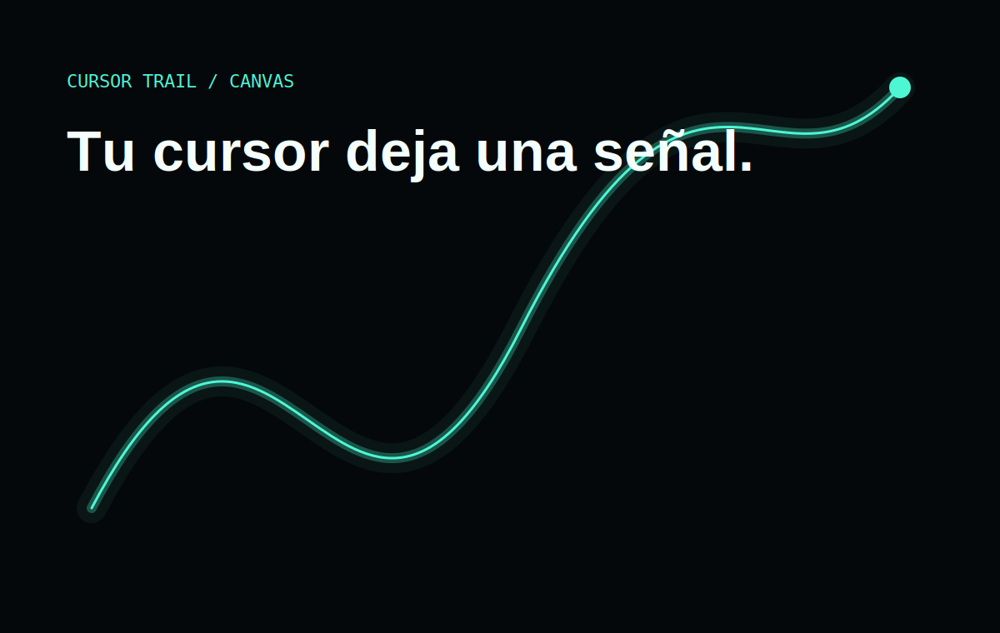

# Neon Cursor Trail Effect

A luminous cursor trail drawn on one canvas, with adjustable intensity and a bounded particle pool.

## Features

- High-density canvas capped at `devicePixelRatio` 2.
- Low, medium, or high intensity.
- Bounded particles with no permanent DOM nodes.
- Automatic disablement on touch and reduced motion.
- Stage, selector, and CTA inside a single viewport.
- Three-layer composition: surface, visible trail, and readable content.

## Live demo

[neon.ntdesweb.dev](https://neon.ntdesweb.dev/)

## More effect demos

- [Animated Login Panel](https://login.ntdesweb.dev/)
- [Floating Navbar](https://navbar.ntdesweb.dev/)
- [Spotlight Card](https://spotlight.ntdesweb.dev/)

## Installation

Clone the repository, enter `neon-cursor-trail-effect`, and open `index.html`.

## Project structure

Canvas and controls in `index.html`, presentation in `style.css`, capture layers in `capture.css`, rendering in `script.js`, and assets in `assets/`.

## Customization

Change `limits`, the RGBA color, `life` decay, and particle size.

## Accessibility

The canvas is decorative, controls are native, and status text explains when the effect is unavailable.

## Performance

One canvas, a configurable particle maximum, rendering stops when empty, and resize is capped at DPR 2.

## License and credits

[MIT](LICENSE). Created by [Nacho Torres](https://github.com/NachoTorresRD) for [NTDESWEB](https://www.ntdesweb.com) with [NT-SKILL SUPREME](https://github.com/NachoTorresRD/nt-skill-supreme).

[View on GitHub](https://github.com/NachoTorresRD/neon-cursor-trail-effect) · [Work with NTDESWEB](https://www.ntdesweb.com)
